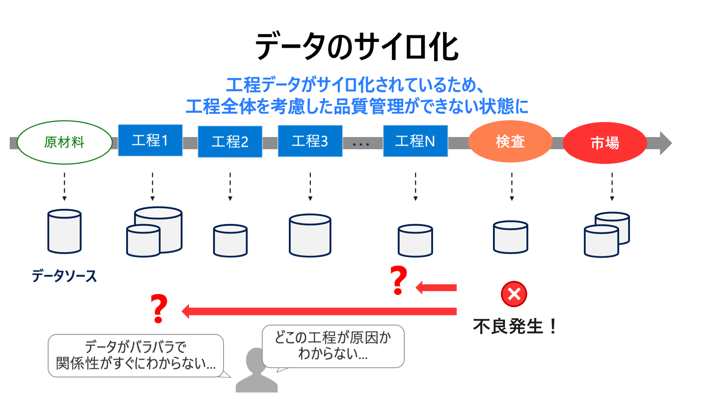
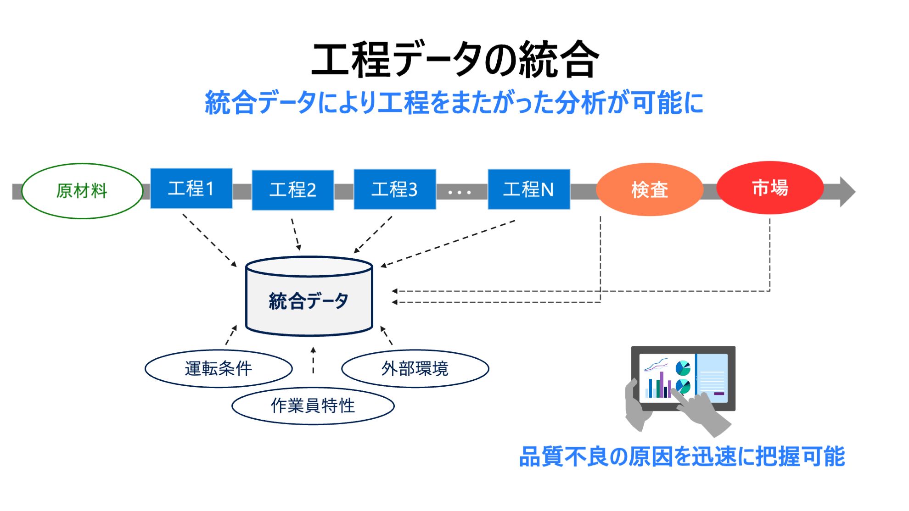
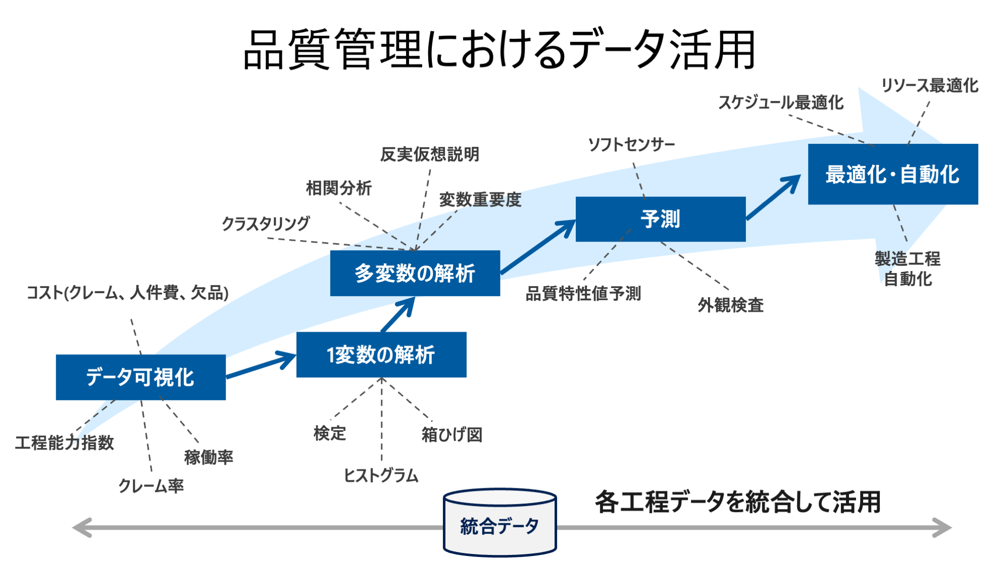

# Quality Control
## データのサイロ化問題
従来から工程ごとに統計的手法を活用した品質管理が進められている。しかしながら、各工程ごとに閉じた分析では工程前後の影響が考慮されず、複雑な工程の場合には分析が難しくなる。

 

そこで各工程のデータと、検査工程のデータ、関連するデータ (市場データ、天候データなどの外部データ etc) を用いて統合データを作成する。この統合データを用いて品質管理を行うことで、工程をまたがったデータ分析が可能になり品質管理の高度化が期待できる。

 

---

## 品質管理におけるデータ活用レベル
- A. データ可視化
- B. 1 変数の解析
- C. 多変数の解析
- D. 予測
- E. 最適化・自動化

//TODO: 項目をアップデートする

 